# 《数据库原理》大作业用户文档

**常珂华 2019010798 刘臣洋 2019011250  杨健辉 2019011248 张博闻 2019013267 **

## 一、运行方式

### 准备工作

删除根目录下`thssdb\data`里的所有文件。在IDEA中执行`maven install`，并指定根目录下`target\generated-sources`为source root。

### 运行Server

在IDER中运行根目录下`src/main/java/cn/edu/thssdb/server/ThssDB.java`的`main()`函数。

### 运行Client

在IDER中运行根目录下`src/main/java/cn/edu/thssdb/client/Client.java`的`main()`函数。

## 二、SQL语句

### 连接服务端

```sql
connect;
```

### 断开连接

```sql
disconnect;
```

### 退出用户端

```sql
quit;
```

### 创建数据库

```sql
create database name;
```

### 删除数据库

```sql
drop database name;
```

### 创建数据表

```sql
create table tableName(AttrName1 AttrType1 [not null],...,AttrNameN AttrTypeN [not null],primaty key(AttrNameX));
create table tableName(AttrName1 AttrType1 [not null][primary key],...,AttrNameN AttrTypeN [not null]);
```

创建数据表时，必须且只能指定一个属性作为主键。有两种方式指定主键。`[ ]`为可选项，下同。

### 删除表

```sql
drop table tableName;
```

### 展示表模式信息

```sql
show table tableName; 
```

### 插入语句

```sql
insert into tableName [(attrName1, attrName2,…, attrNameN)] values (attrValue1, attrValue2,…, attrValueN);
```

指定插入属性时，声明的属性需包含所有`not null`属性，且个数需与属性值个数相等。

### 更新语句

```sql
update tableName set attrName = attrValue 
[where attrName1 = attrValue1 [and/or attrName2 = attrValue2] ];
```

`where`支持使用`and`或`or`连接的两个比较运算。比较运算包括：`<、>、<=、>=、=、<>`，其左运算符需为属性名，右运算符需为常元。

### 删除语句

```sql
delete from tableName [where attrName1 = attrValue1 [and/or attrName2 = attrValue2] ];
```

`where`支持使用`and`或`or`连接的两个比较运算。比较运算包括：`<、>、<=、>=、=、<>`，其左运算符需为属性名，右运算符需为常元。

### 选择语句

```sql
#自然连接
select attrName1,...,attrName2 from table1[,table2]
[where attrName1 = attrValue1 [and/or attrName2 = attrValue2] ]; 
#笛卡尔积并用on所接表达式筛选结果
select * from table1 join table2 on attrName1 = attrName2 
[where attrName1 = attrValue1]; 
```

选择语句的属性名需写作`table.attrname`的形式。对自然连接语句的重复属性，在`select`语句中，只能用`from`语句的第一个表即`table1.attrName`来指代。

`where`支持使用`and`或`or`连接的两个比较运算。比较运算包括：`<、>、<=、>=、=、<>`，其左运算符需为属性名，右运算符需为常元。

`on`支持使用`and`或`or`连接的两个比较运算。比较运算包括：`<、>、<=、>=、=、<>`，其左运算符需为属性名，右运算符可为常元或属性名。

### 开始事务

```sql
begin transaction;
```

本数据库采用`read committed`的隔离机制。当事务A在修改某一数据表时，事务B若想访问该表，B会被阻塞直至A事务提交。

### 提交事务

```sql
commit;
```

## 三、功能演示

### 1. 查询模块

#### 数据表的创建、查询、删除

```sql
#测试用例
connect;

create table t1(a1 Int, a2 String(15) not null, a3 Double, a4 Float, a5 Long, Primary Key(a1));
create table t2(a1 Int, a2 String(15) not null, a3 Double Primary Key);
show table t1;
show table t2;
drop table t1;
drop table t2;
```

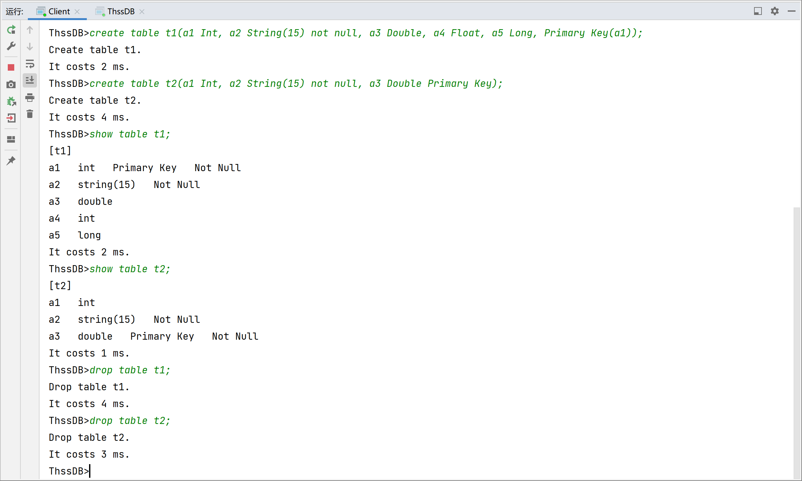

#### 数据的查询、插入、删除、修改

```sql
#测试用例
connect;

drop table t1;
drop table t2;
create table t1(id1 Int, name String(15) not null, Primary Key(id1));
create table t2(id2 Double Primary Key, name String(15) not null);

insert into t1 values (1,'Sichuan');
insert into t1 values (2,'Shanghai');
insert into t1(id1) values (3);#提示name不应为空
insert into t1(name, id1) values ('Shanghai',3);
insert into t1 values (4,'Beijing');
insert into t1 values (10,'Xinjiang');

insert into t2 values (1,'Sichuan');
insert into t2 values (2,'Shanghai');
insert into t2 values (3,'Beijing');
insert into t2 values (4,'Beijing');
insert into t2 values (5,'Tianjin');

select * from t1;
select * from t1,t2 where t1.id1 >=2;
select * from t1,t2 where t1.name='Beijing' and t2.id2 >3;
select t1.name, t2.id2 from t1,t2 where t1.name='Beijing' or t2.id2 >3;
select * from t1 join t2 on t1.id1<t2.id2;
select * from t1 join t2 on t1.id1<3;
select * from t1 join t2 on t1.id1>t2.id2 where t2.name<>'Beijing';

select * from t1;
select * from t2;
update t1 set name='Guangdong' where id1>2 and name='Beijing';
select * from t1;
update t1 set name='Guizhou' where id1>2 or name='Guangdong';
select * from t1;
update t1 set name='Hebei' where id1=1;
select * from t1;

delete from t2 where name='Shanghai' or id2 <3;
select * from t2;
delete from t1 where name='Guangdong';
select * from t1;
delete from t1 where name='Guizhou' and id1 = 4;
select * from t1;
```

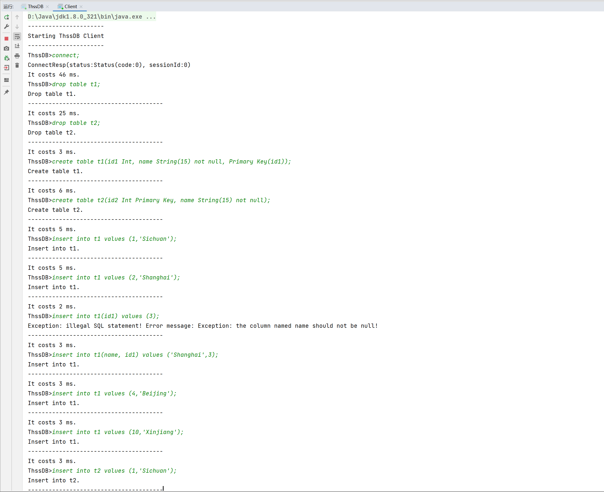

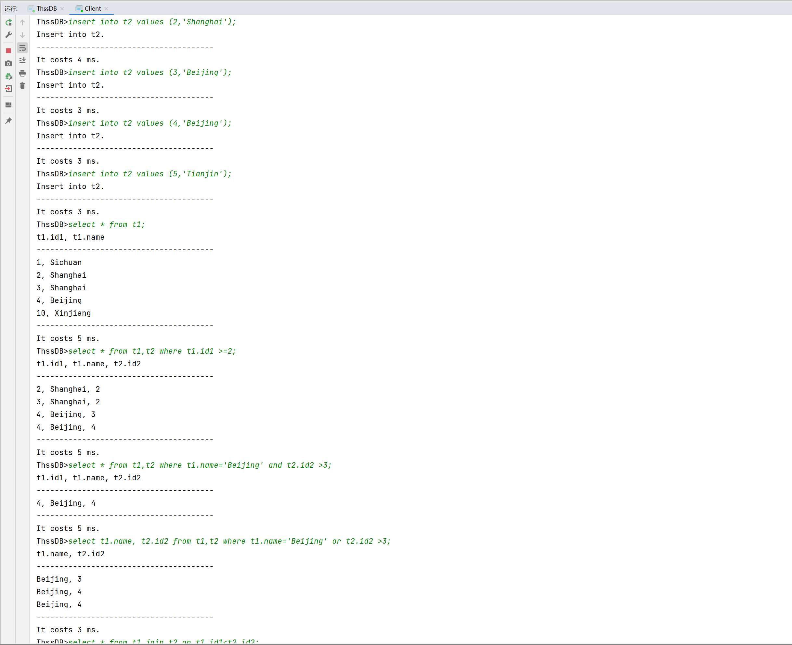

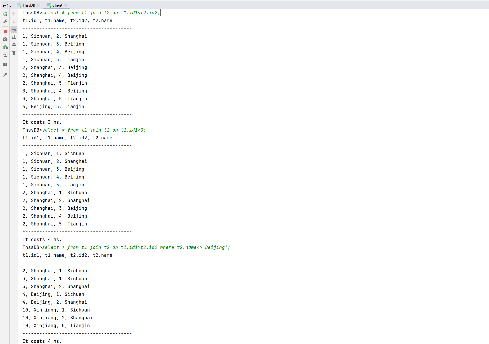

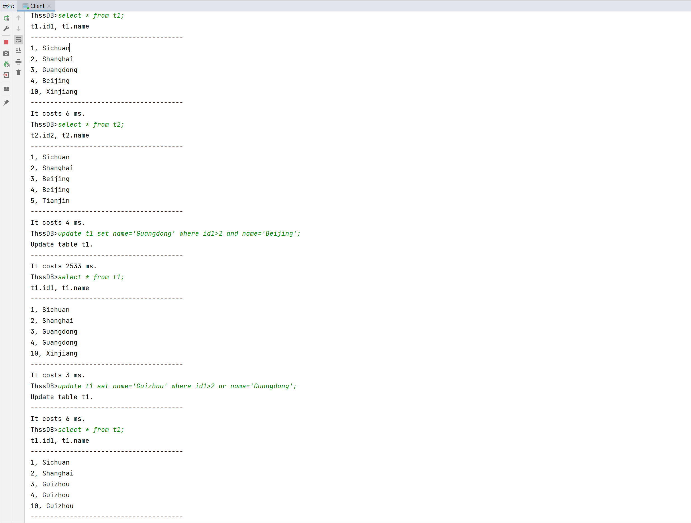

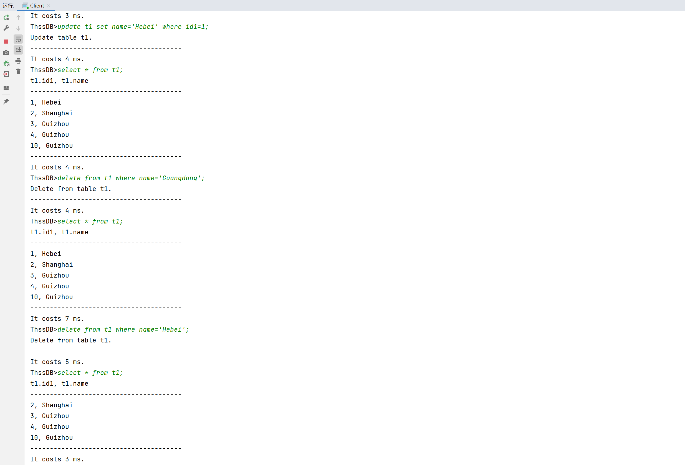

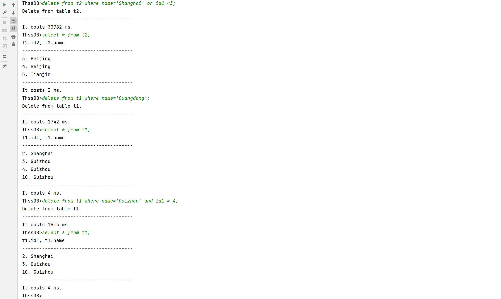

### 2.事务并发与恢复模块

#### 事务与恢复

```sql
#测试用例
connect;

drop table t1;
create table t1(id1 Int, name String(15) not null, Primary Key(id1));

begin transaction;
insert into t1 values (1,'Sichuan');
insert into t1 values (3,'Beijing');
insert into t1 values (4,'Beijing');
update t1 set name='Hubei' where id1=3;
delete from t1 where id1=4;
select * from t1;
commit;

begin transaction;
insert into t1 values (5,'Sichuan');
insert into t1 values (6,'Shanghai');
update t1 set name='Guangdong' where id1=1;
delete from t1 where id1=3;
select * from t1;

#关闭服务端和用户端
#重启服务端和用户端

connect;
select * from t1;
```

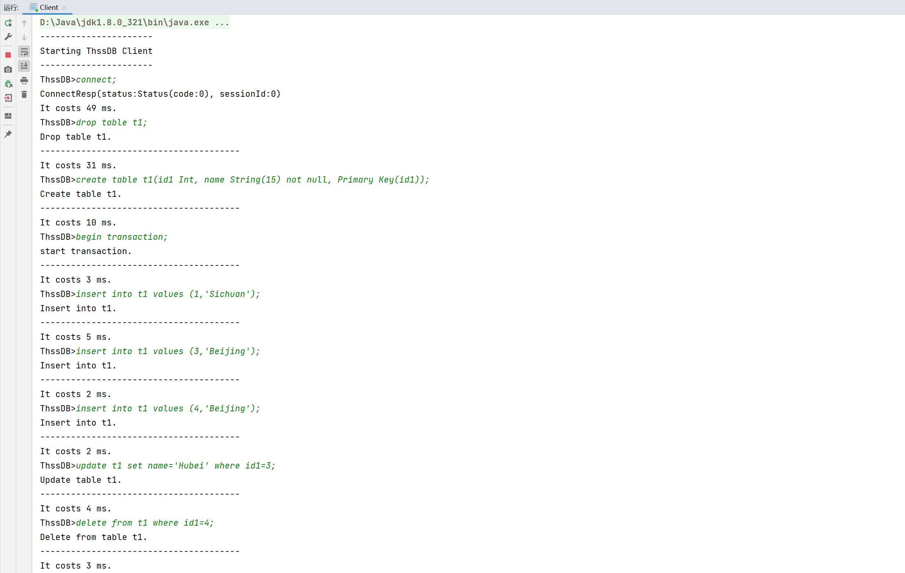

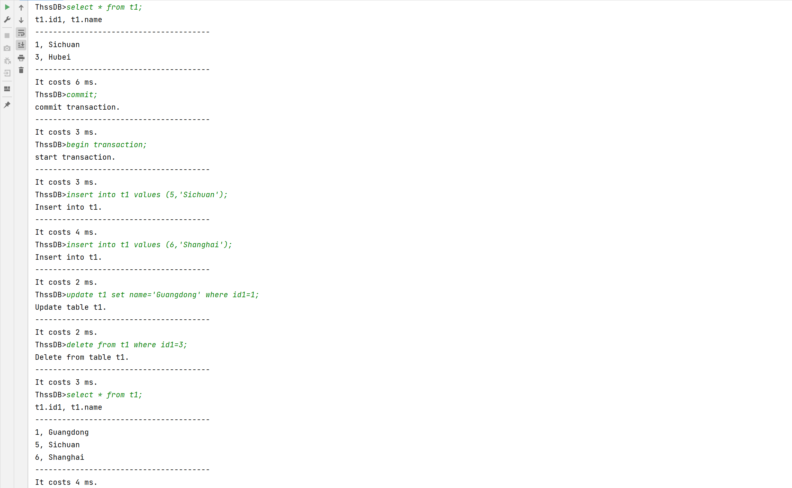

重启服务端和用户端后：

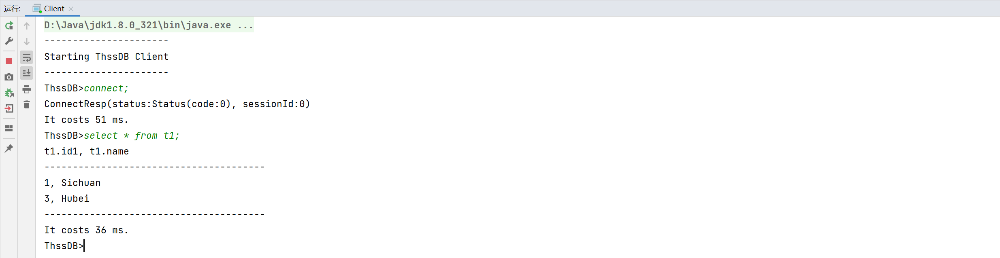

#### **实现read committed隔离级别**

```sql
#测试用例
connect;#session 0
connect;#session 1

#以下代码块顺序代表执行顺序

###session0
drop table t1;
drop table t2;
create table t1(id1 Int, name String(15) not null, Primary Key(id1));
create table t2(id2 Double Primary Key, name String(15) not null);
insert into t2 values (5,'Tianjin');
begin transaction;
insert into t1 values (1,'Sichuan');
###

###session1
begin transaction;
select * from t2;#正常访问
select * from t1;#由于session0在访问，阻塞
###

###session0
commit;#session1恢复执行
select * from t1;#正常访问
###

###session1
insert into t1 values (8,'Xinjiang');
###

###session0
select * from t1;#阻塞
###

###session1
commit;#session0恢复执行
###
```

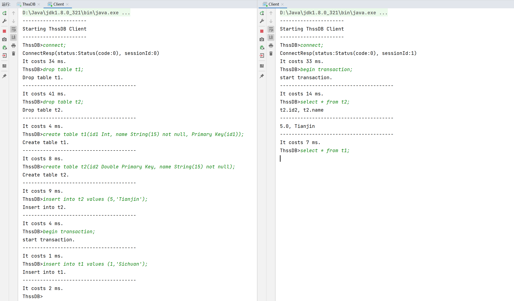

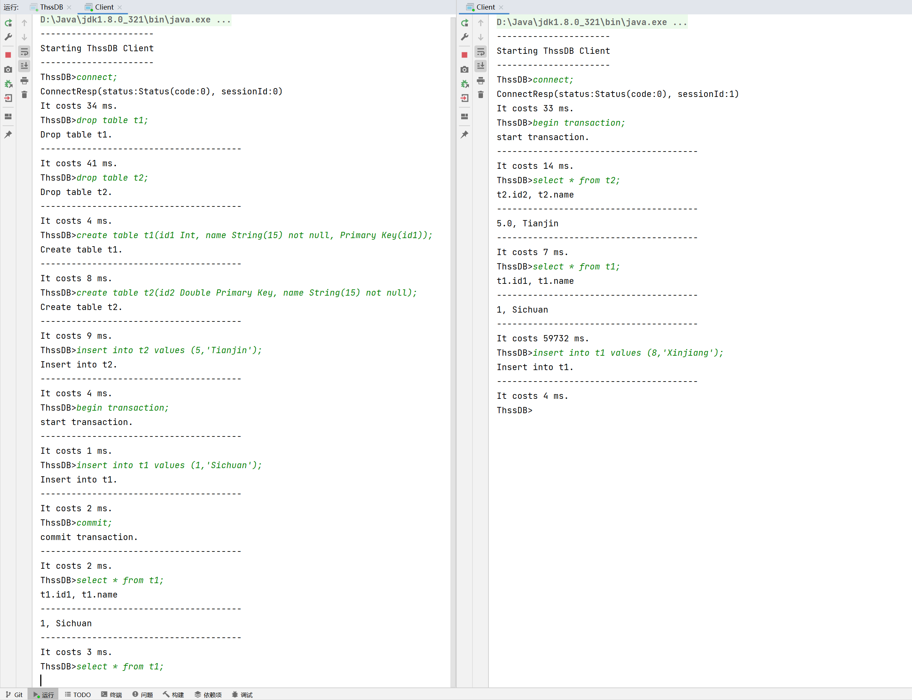

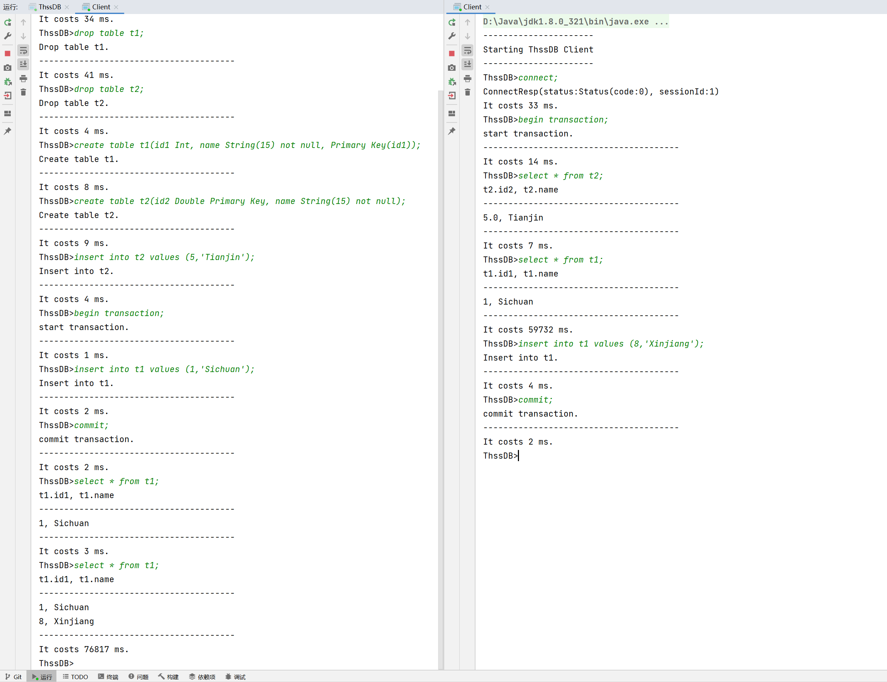

#### 多事务并发与恢复

```sql
#测试用例
connect;#session 0
connect;#session 1

#以下代码块顺序代表执行顺序

###session0
drop table t1;
drop table t2;
create table t1(id1 Int, name String(15) not null, Primary Key(id1));
create table t2(id2 Double Primary Key, name String(15) not null);
begin transaction;
insert into t1 values (1,'Sichuan');
insert into t1 values (2,'Sichuan');
###

###session1
begin transaction;
insert into t2 values (1,'Hunan');
insert into t2 values (2,'Hunan');
insert into t2 values (3,'Hebei');
update t2 set name='Tianjin' where id2=3;
###

###session0
delete from t2 where id2=1;#阻塞
###

###session1
commit;
###

###session0
insert into t2 values (4,'Beijing');
commit;
select * from t1;
select * from t2;
###

#关闭服务端和用户端
#重启服务端和用户端

###session0
connect;
select * from t1;
select * from t2;
###
```

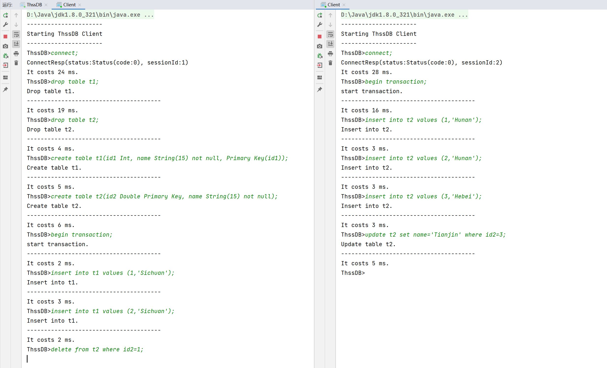

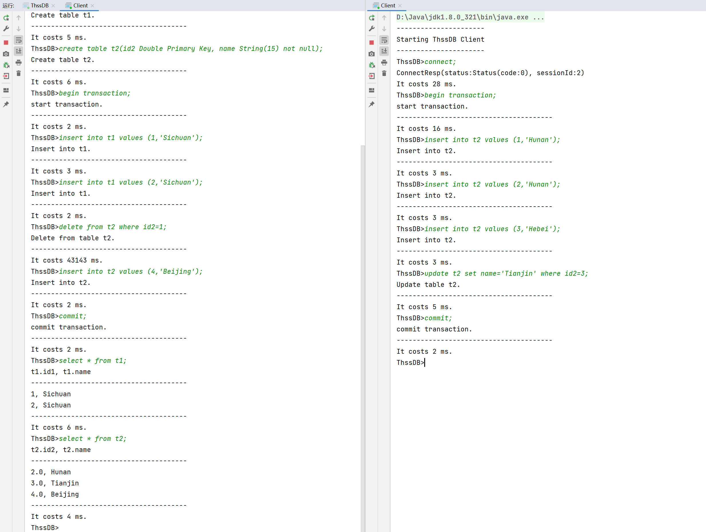

重启后：

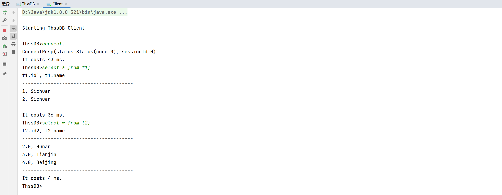
